# Schrödinger Equation for the Hydrogen Atom

This project documents a Partial Differential Equations and Complex Analysis study of the Schrödinger equation for the hydrogen atom. It focuses on deriving the time-independent hydrogen-atom solution using separation of variables in spherical coordinates, then visualizing selected spherical harmonics, hydrogen wave-function outputs, orbital surfaces, and hydrogen energy levels using MATLAB-supported plots.

## Preview

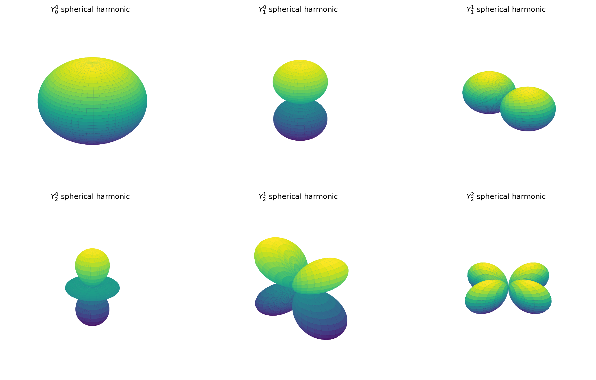

The spherical harmonics grid shows selected normalized angular wave-function shapes for low-order quantum numbers.

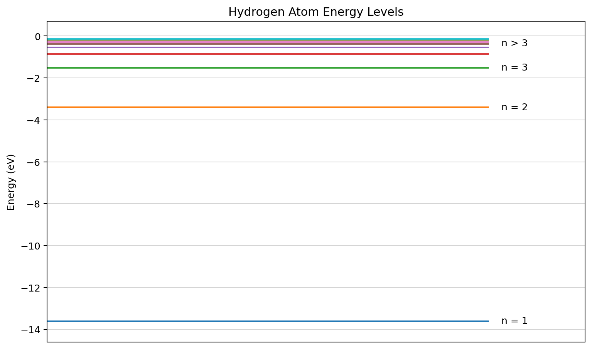

The energy-level plot visualizes the hydrogen spectrum using the inverse-square relationship between the energy level and the principal quantum number.

## Probability-Density Outputs

The probability-density outputs are kept as individual images instead of using the full report table as a screenshot.

<table>
  <thead>
    <tr>
      <th>State <code>(n, l, m)</code></th>
      <th>2D probability-density view</th>
      <th>3D probability-density view</th>
    </tr>
  </thead>
  <tbody>
    <tr>
      <td><code>(2, 0, 0)</code></td>
      <td>
        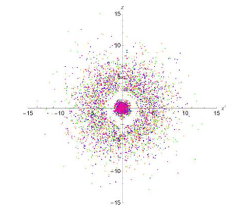
      </td>
      <td>
        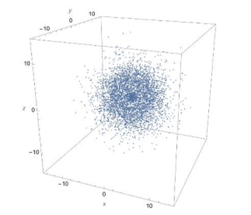
      </td>
    </tr>
    <tr>
      <td><code>(3, 1, 0)</code></td>
      <td>
        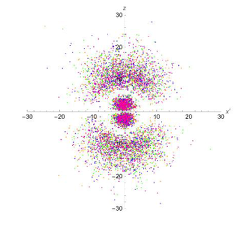
      </td>
      <td>
        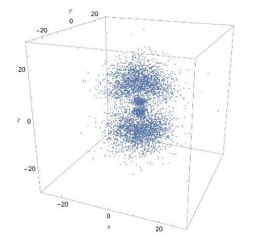
      </td>
    </tr>
    <tr>
      <td><code>(4, 3, 0)</code></td>
      <td>
        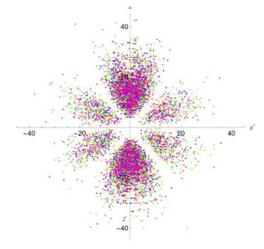
      </td>
      <td>
        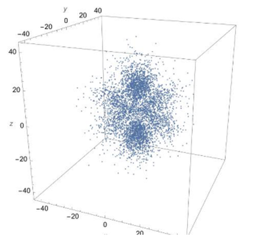
      </td>
    </tr>
  </tbody>
</table>

## Orbital Surface Outputs

The simulated surfaces of `|psi|^2` are kept as individual images instead of using the full report table as a screenshot.

<table>
  <thead>
    <tr>
      <th>State <code>(n, l, m)</code></th>
      <th>Simulated surface of <code>|psi|^2</code></th>
    </tr>
  </thead>
  <tbody>
    <tr>
      <td><code>(2, 0, 0)</code></td>
      <td>
        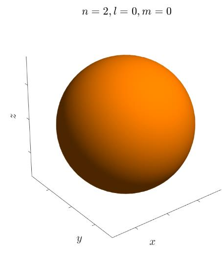
      </td>
    </tr>
    <tr>
      <td><code>(3, 1, 0)</code></td>
      <td>
        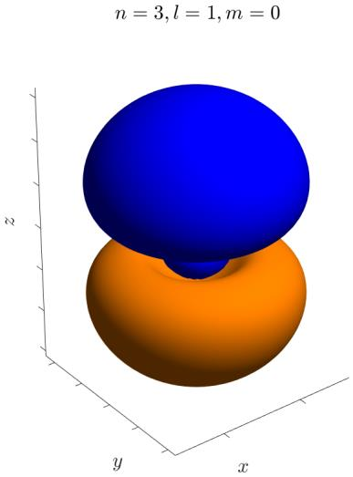
      </td>
    </tr>
    <tr>
      <td><code>(4, 3, 0)</code></td>
      <td>
        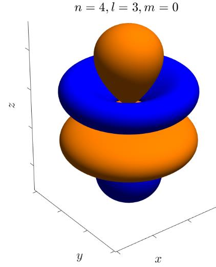
      </td>
    </tr>
  </tbody>
</table>

## Results

The final results give the hydrogen energy levels, the general hydrogen wave-function form, and the quantum-number constraints.

### Hydrogen energy levels

> **Energy per level**
>
> Eₙ = - [ m / (2ℏ²) × ( e² / 4πϵ₀ )² ] × 1/n²  
> Eₙ = E₁ / n²

### Hydrogen wave-function form

> **General hydrogen wave function**
>
> ψₙₗₘ(r, θ, φ) =
>
> √[ (2 / na)³ × (n - l - 1)! / 2n[(n + l)!]³ ]  
> × e^(-r/na)  
> × (2r / na)ˡ  
> × Lₙ₋ₗ₋₁²ˡ⁺¹(2r / na)  
> × Yₗᵐ(θ, φ)

### Quantum-number constraints

> n = 1, 2, 3, ...
>
> l = 0, 1, 2, ..., n - 1
>
> m = -l, ..., 0, ..., l

### Constants used in these equations

| Symbol | Meaning |
|---|---|
| Eₙ | Energy per level |
| m in the energy formula | Equivalent mass at the center of gravity between electron and nucleus |
| ℏ | Reduced Planck's constant |
| e | Electric charge |
| ϵ₀ | Permittivity of free space |
| n | Principal quantum number |
| l | Azimuthal quantum number |
| m | Magnetic quantum number |
| a | Bohr radius |

## Contents

* `docs/` - final report PDF
* `matlab/` - MATLAB scripts for spherical harmonics and hydrogen energy levels
* `public/images/` - project images used in the README and portfolio page

## MATLAB Scripts

| File | Purpose |
|---|---|
| `matlab/sphericalHarmonics.m` | Plots a spherical harmonic surface for selected `L` and `M` values. |
| `matlab/plot_spherical_harmonics_grid.m` | Calls `sphericalHarmonics.m` for selected low-order harmonics and arranges them in a grid. |
| `matlab/plot_energy_levels.m` | Plots the first hydrogen energy levels using `E_n = -13.6 / n^2` eV. |

## Main Features

* Derivation of the time-independent Schrödinger equation for the hydrogen atom
* Separation of variables in spherical coordinates
* Angular solution using associated Legendre functions and spherical harmonics
* Radial solution leading to quantized hydrogen energy levels
* MATLAB visualization of selected spherical harmonics
* MATLAB visualization of hydrogen energy levels
* Individual probability-density and orbital-surface output images
* Final academic report documenting the derivation, results, and references

## Technical Overview

The report starts from the Schrödinger equation and applies the Hamiltonian operator to obtain the time-dependent form. The time-independent equation is then separated in spherical coordinates into radial and angular components.

The angular solution leads to spherical harmonics, which describe the angular part of the hydrogen wave functions. The radial solution leads to the hydrogen energy relation, where the energy levels follow an inverse-square dependence on the principal quantum number.

The MATLAB scripts support the final visualization stage of the project by plotting selected spherical harmonics and the hydrogen energy spectrum.

## How to Run / Review

Open MATLAB from the project root or from the `matlab/` folder.

To generate the spherical harmonics grid, run:

```matlab
matlab/plot_spherical_harmonics_grid.m
```

To generate the energy-level plot, run:

```matlab
matlab/plot_energy_levels.m
```

The final report is available at:

```text
docs/schrodinger-hydrogen-atom-report.pdf
```

## Limitations

This is a basic academic PDE/quantum-mechanics project focused on mathematical derivation and MATLAB visualization. It is not intended to be a full quantum-simulation software package.
